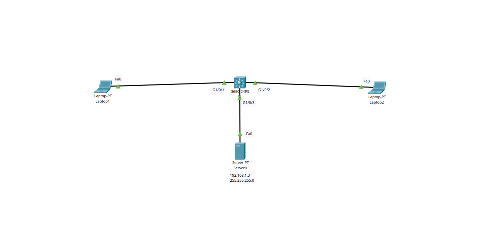

# Simple Web Server

Esse é um projeto onde mostro meus conhecimentos sobre configuração de host, switch and web server.

## Geral

## Laptop1 

Configuração do Laptop1:

- Mask Address
- IPv4 Address
- DNS
- Subnet Mask
- Default Gateway
- DNS Server

## Laptop 2

Configuração do Laptop 2:

- Mask Address
- IPv4 Address
- DNS
- Subnet Mask
- Default Gateway
- DNS Server

## Server

Configuração do Web Server:

- MAC Address
- IPv4 Address
- Subnet Mask
- Default Gateway 
- DNS Server
- HTTP/HTTPS On

## Testes

Testando conectividade do Laptop 1 para o server:

Após enviar uma requisição ao servidor web através do IP "192.168.1.3" ele devolve algumas páginas HTML.

